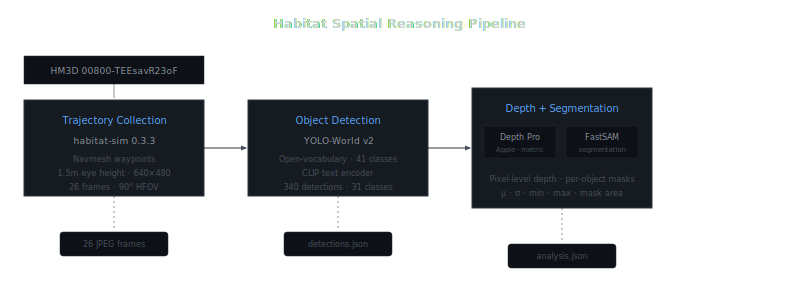
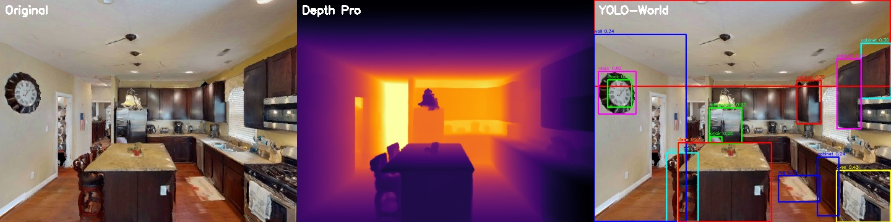
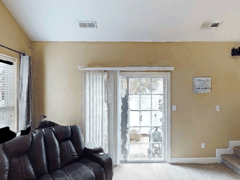

# Habitat Spatial Reasoning Pipeline

End-to-end egocentric perception on HM3D photorealistic scenes — trajectory collection, open-vocabulary object detection, monocular depth estimation, and per-object spatial analysis.

*NYU WIRELESS · Prof. Sundeep Rangan · Summer 2026 · Track 2: Spatial Reasoning*

---

<p align="center">
  
</p>

**Figure 1.** Three-stage pipeline. HM3D scene data flows through trajectory collection (habitat-sim), object detection (YOLO-World v2), and combined depth estimation with segmentation (Depth Pro + FastSAM). Each stage interfaces via standard JPEG/JSON artifacts.

---

## Results

All metrics measured on HM3D scene `00800-TEEsavR23oF` — a 398 m² furnished residential space (2 floors, 7 rooms). Hardware: Apple M1 Max.

| | |
|---|---|
| Trajectory frames | 26 |
| Object detections | 340 |
| Unique classes | 31 |
| Depth range | 1.12 – 16.05 m |
| Mean detections per frame | 13.1 |
| Detection confidence threshold | 0.15 |

<p align="center">
  
</p>

**Figure 2.** Frame 0001 from HM3D `00800-TEEsavR23oF`. Left: original RGB. Center: Depth Pro metric depth (Inferno, 1.7–12.7 m). Right: YOLO-World v2 — 23 objects across 14 classes.

### Per-object depth — Frame 0000

| Object | Conf. | Mean depth | σ | Range | Mask pixels |
|---|---|---|---|---|---|
| couch | 0.86 | 3.11 m | 0.41 | [2.28, 4.64] m | 36,527 |
| ceiling | 0.50 | 3.92 m | 0.56 | [2.35, 6.11] m | 67,403 |
| sofa | 0.44 | 4.59 m | 0.36 | [3.54, 5.69] m | 2,676 |
| chair | 0.33 | 6.79 m | 0.68 | [5.43, 8.56] m | 1,051 |
| floor | 0.35 | 4.39 m | 2.10 | [2.95, 14.66] m | 14,646 |

### Detected classes (31)

`cabinet` · `ceiling` · `wall` · `couch` · `pillow` · `floor` · `window` · `chair` · `lamp` · `mirror` · `rug` · `door` · `sofa` · `table` · `curtain` · `desk` · `oven` · `picture` · `plant` · `refrigerator` · `sink` · `television` · `clock` · `book` · `bag` · `bottle` · `bowl` · `bed` · `person` · `tv` · `vase`

### Depth ranges by frame

| Frame | Min | Max | Span | Notable |
|---|---|---|---|---|
| 0000 | 2.28 m | 16.05 m | 13.77 m | couch at 3.11 m, chair at 6.79 m |
| 0001 | 1.65 m | 12.67 m | 11.02 m | refrigerator at 5.39 m |
| 0002 | 2.61 m | 4.12 m | 1.51 m | narrow corridor — minimal depth variation |
| 0003 | 1.86 m | 8.48 m | 6.62 m | bedroom with open doorway |
| 0004 | 1.12 m | 9.11 m | 7.99 m | close to cabinet, deep sightline |

---

## Trajectory

<p align="center">
  
</p>

**Figure 3.** 26-frame navmesh-constrained walkthrough. Camera at 1.5 m eye height, 90° HFOV, 640×480. Quaternion gaze toward next waypoint.

---

## Setup

**One-time bootstrap:**

```bash
bash scripts/setup.sh
```

This creates both environments (conda for habitat-sim, uv for ML models), downloads Depth Pro, and sets up symlinks.

Two isolated Python environments resolve native dependency conflicts:

| Environment | Python | Manager | Purpose |
|---|---|---|---|
| `habitat-sim` | 3.9 | conda | 3D rendering — habitat-sim 0.3.3 |
| `.venv` | 3.12 | uv | ML models — PyTorch 2.11, YOLO-World, Depth Pro, FastSAM |

**Pipeline stages:**

```bash
# Stage 1 — Trajectory (conda: habitat-sim requires native C++ bindings)
conda run -n habitat-sim python scripts/collect_trajectory.py \
  --scene data/hm3d/minival/00800-TEEsavR23oF/TEEsavR23oF.basis.glb

# Stage 2 — Detection (uv: ML models)
uv run python scripts/detect_objects.py

# Stage 3 — Depth + Segmentation + Analysis
uv run python scripts/analyze_scene.py
```

**HM3D data** requires a Matterport API token:

```bash
conda run -n habitat-sim python -m habitat_sim.utils.datasets_download \
  --username <token-id> --password <token-secret> \
  --uids hm3d_minival_v0.2 --data-path data/
```

---

## Design

**Modular stage interfaces.** Each stage communicates through JPEG and JSON — standard, inspectable formats. Replacing YOLO-World with DETR or Depth Pro with MiDaS requires no changes to other stages.

**Open-vocabulary detection.** Object categories are specified as a natural language vocabulary. Changing from "chair, table" to "fire extinguisher, exit sign" needs no retraining — only a text prompt change.

**Navmesh-constrained navigation.** Waypoints restricted to navigable regions produce realistic human-like walking patterns through the scene geometry.

**FastSAM as NanoSAM proxy.** NanoSAM targets NVIDIA Jetson with TensorRT. FastSAM provides equivalent functionality (bbox → mask) through ultralytics with no custom build.

---

## Limitations

| Constraint | Mitigation |
|---|---|
| Depth Pro: 5–10 s/frame on CPU | Offline batch processing; evaluate MPS backend for Apple Silicon |
| FastSAM 640 px resize causes mask artifacts | Bilinear interpolation upgrade |
| No temporal object identity across frames | Hungarian matching + Kalman filtering |
| Textureless surfaces → near-zero detections | Expected for geometric test scenes; HM3D provides full texture coverage |
| Thin structures below detection threshold | SAM-family models struggle with sub-10 px features |
| Monocular depth ambiguity at boundaries | Denser trajectory improves multi-view consistency |

---

## References

[AI Habitat](https://aihabitat.org/) · [HM3D v0.2](https://aihabitat.org/datasets/hm3d/) · [YOLO-World (CVPR 2024)](https://github.com/AILab-CVC/YOLO-World) · [Depth Pro (Apple, 2024)](https://github.com/apple/ml-depth-pro) · [NanoSAM](https://github.com/NVIDIA-AI-IOT/nanosam) · [FastSAM (ICCV 2023)](https://github.com/CASIA-IVA-Lab/FastSAM)

---

*Documentation: [asheshkaji.com/habitat](http://asheshkaji.com/habitat/)*
