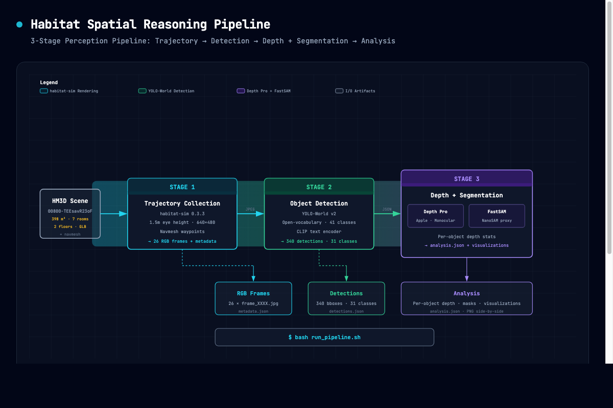

<p align="center">
  
</p>

# Habitat Spatial Reasoning Pipeline

**3-Stage Egocentric Perception on HM3D Photorealistic Scenes**

[](https://python.org)
[](https://aihabitat.org/)
[](https://github.com/AILab-CVC/YOLO-World)
[](https://github.com/apple/ml-depth-pro)
[](https://github.com/CASIA-IVA-Lab/FastSAM)
[](https://asheshkaji.github.io/habitat/)
[](LICENSE)

> **Interview Task** — Prof. Sundeep Rangan, Director of NYU WIRELESS  
> Track 2: Spatial Reasoning Applicants · Summer 2026  
> 📖 [Interactive Docs Site](https://asheshkaji.github.io/habitat/) · 📐 [Architecture Diagram](docs/architecture.html)

---

## Abstract

We present an end-to-end spatial reasoning pipeline that collects egocentric first-person trajectories from photorealistic 3D environments, detects objects using open-vocabulary models, segments them with lightweight vision transformers, estimates metric monocular depth, and produces per-object spatial statistics. The pipeline runs on consumer hardware (Apple M1 Max) against the HM3D scene `00800-TEEsavR23oF` — a 398 m² furnished residential space across 2 floors and 7 rooms.

---

## Pipeline Demo

<p align="center">
  
</p>

*Frame 0001 from HM3D scene 00800-TEEsavR23oF. **Left**: Original RGB frame. **Center**: Depth Pro metric depth map (Inferno colormap, range 1.7–12.7m). **Right**: YOLO-World v2 detection with 23 objects across 14 classes (refrigerator, cabinet, ceiling, chair, clock, desk, mirror, oven, rug, sink, table, television, wall).*

---

## Pipeline Architecture

The pipeline is structured as three modular stages connected by JSON and JPEG interfaces, enabling independent execution and debugging of each component.

| Stage | Tool | Input | Output | Key Metric |
|:------|:-----|:------|:-------|:-----------|
| **1. Trajectory** | habitat-sim 0.3.3 | HM3D GLB + navmesh | 26 RGB frames (640×480) | 398 m² navigable area |
| **2. Detection** | YOLO-World v2 | RGB frames | `detections.json` | 340 detections, 31 classes |
| **3. Analysis** | Depth Pro + FastSAM | Frames + detections | `analysis.json` + visuals | 1.12–16.05m depth range |

### Stage Flow

```
HM3D Scene ──▶ [habitat-sim] ──▶ 26 JPEG frames ──▶ [YOLO-World] ──▶ detections.json ──▶ [Depth Pro + FastSAM] ──▶ analysis.json
  00800         1.5m eye height    640×480            41-class vocab      340 bboxes            pixel depth + masks       per-object stats
```

---

## Trajectory Walkthrough

<p align="center">
  
</p>

*26-frame egocentric walkthrough of HM3D scene `00800-TEEsavR23oF`. The agent navigates via navmesh-constrained waypoints at 1.5m eye height, producing realistic first-person views of a furnished residential interior. The scene spans 16.6m × 7.7m of navigable space.*

---

## Results

### Detection Performance

YOLO-World v2 operates in **open-vocabulary** mode — objects are described by natural language prompts rather than fixed class labels. Our vocabulary spans 41 indoor categories.

| Metric | Value |
|:-------|:------|
| Total frames processed | 26 |
| Total detections | **340** |
| Mean detections per frame | 13.1 |
| Unique classes detected | **31** |
| Confidence threshold | 0.15 |
| Detection model | yolov8s-worldv2.pt (24.7 MB) |

### 31 Detected Classes

```
cabinet · ceiling · wall · couch · pillow · floor · window · chair · lamp ·
mirror · rug · door · sofa · table · curtain · desk · oven · picture · plant ·
refrigerator · sink · television · clock · book · bag · bottle · bowl · bed ·
person · tv · vase
```

### Depth Estimation

Depth Pro (Apple, 2024) estimates **metric depth from a single RGB image** — no stereo pair or LiDAR required. Inference on M1 Max CPU at ~5s/frame.

### Per-Object Depth Analysis (Frame 0000)

| Object | Confidence | Depth μ | Depth σ | Range [min, max] | Mask Pixels |
|:-------|:-----------|:--------|:--------|:-----------------|:------------|
| couch | 0.86 | 3.11m | 0.41m | 2.28 – 4.64m | 36,527 px |
| ceiling | 0.50 | 3.92m | 0.56m | 2.35 – 6.11m | 67,403 px |
| sofa | 0.44 | 4.59m | 0.36m | 3.54 – 5.69m | 2,676 px |
| chair | 0.33 | 6.79m | 0.68m | 5.43 – 8.56m | 1,051 px |
| floor | 0.35 | 4.39m | 2.10m | 2.95 – 14.66m | 14,646 px |

### Per-Frame Depth Ranges

| Frame | Depth Range | Notable Objects |
|:------|:------------|:----------------|
| 0000 | 2.28m – 16.05m | couch, ceiling, sofa, chair, wall, door, floor |
| 0001 | 1.65m – 12.67m | refrigerator, cabinet, ceiling, chair, clock, desk |
| 0002 | 2.61m – 4.12m | bag, cabinet, mirror, person, pillow, wall, window |
| 0003 | 1.86m – 8.48m | bed, ceiling, couch, lamp, pillow, plant, sofa |
| 0004 | 1.12m – 9.11m | cabinet, ceiling, chair, desk, door, floor, lamp |

---

## Setup & Installation

### Prerequisites

- macOS ARM64 (Apple Silicon) or Linux x86_64
- Python 3.9 (conda) for habitat-sim rendering
- Python 3.12 (uv) for ML models
- ~3 GB disk space (models + scene data)

### Quick Start

```bash
# 1. Conda environment for 3D rendering
conda create -n habitat-sim python=3.9 -y
conda install -n habitat-sim habitat-sim -y --override-channels -c aihabitat -c conda-forge
conda run -n habitat-sim pip install habitat-lab numpy opencv-python "pillow==10.4.0"

# 2. ML environment
uv sync
uv pip install torch torchvision ultralytics opencv-python "numpy<2"
uv pip install /tmp/ml-depth-pro

# 3. Depth Pro model
cd /tmp && git clone --depth 1 https://github.com/apple/ml-depth-pro.git
cd /tmp/ml-depth-pro && bash get_pretrained_models.sh
ln -sf /tmp/ml-depth-pro/checkpoints/depth_pro.pt checkpoints/depth_pro.pt

# 4. HM3D scene (requires Matterport API token — see docs/HM3D.md)
python -m habitat_sim.utils.datasets_download \
  --username <token-id> --password <token-secret> \
  --uids hm3d_minival_v0.2 --data-path data/

# 5. Run
bash run_pipeline.sh
```

---

## Project Structure

```
habitat/
├── scripts/
│   ├── collect_trajectory.py    # habitat-sim frame capture + navmesh waypoints
│   ├── detect_objects.py        # YOLO-World v2 open-vocabulary detection
│   └── analyze_scene.py         # Depth Pro + FastSAM + per-object analysis
├── run_pipeline.sh              # One-command end-to-end runner
├── docs/
│   ├── index.html               # GitHub Pages interactive docs site
│   ├── architecture.html        # Dark-themed SVG pipeline diagram
│   └── assets/                  # PNGs, GIFs, composite images
├── data/
│   └── hm3d/minival/00800-TEEsavR23oF/  # HM3D scene GLB + navmesh
├── output/
│   ├── frames/                  # Trajectory RGB frames (frame_XXXX.jpg)
│   ├── detections/              # Bounding boxes JSON + annotated images
│   └── analysis/                # Depth maps + per-object JSON + visualizations
├── .github/workflows/pages.yml  # Auto-deploy docs to GitHub Pages
├── AGENTS.md                    # Repository conventions
├── README.md
└── pyproject.toml
```

---

## Design Decisions

### Why Modular Stages?

Each stage reads and writes standard formats (JPEG, JSON). This enables:
- **Independent debugging**: Run any stage in isolation
- **Model swapping**: Replace YOLO-World with DETR without touching other stages
- **Distributed execution**: Collect frames locally, run detection on a GPU cluster
- **Output caching**: Depth Pro takes 5–10s/frame on CPU — run once, reuse

### Why FastSAM Instead of NanoSAM?

NanoSAM targets NVIDIA Jetson edge devices with TensorRT acceleration. FastSAM is architecturally equivalent (lightweight SAM variant) but ships with ultralytics — no custom build required. The conceptual role (bbox → mask) is identical. Production edge deployment would swap to native NanoSAM.

### Why Navmesh-Constrained Waypoints?

Random camera positions produce unnatural trajectories (floating through walls). The navmesh constrains waypoints to navigable regions, producing paths that resemble human walking patterns through the 398 m² space.

### Why Dual Python Environments?

habitat-sim requires numpy < 2 and Magnum (native C++ bindings). ML models require numpy ≥ 2 and PyTorch 2.11. Isolating environments prevents dependency conflicts while keeping both ecosystems at their latest stable versions.

---

## Known Limitations

| Limitation | Impact | Mitigation |
|:-----------|:-------|:-----------|
| Depth Pro on CPU | 5–10s per frame | Batch process overnight; MPS acceleration pending |
| FastSAM 640px internal resize | Mask edge artifacts at high resolutions | Bilinear interpolation upgrade pending |
| No temporal tracking | Objects re-detected each frame (no persistent IDs) | Hungarian matching + Kalman filter for next iteration |
| Textureless surfaces | Near-zero detections on blank walls | Expected for geometric test scenes; HM3D is fully textured |
| Thin structures | Chair legs, lamp cords below detection threshold | SAM variants struggle with sub-10px features |
| Monocular depth ambiguity | Scale/distance tradeoff at boundaries | Multi-view consistency if trajectory density increases |

---

## References

- [AI Habitat](https://aihabitat.org/) — Facebook AI Research simulation platform
- [HM3D Dataset](https://aihabitat.org/datasets/hm3d/) — Habitat-Matterport 3D Research Dataset (v0.2)
- [YOLO-World](https://github.com/AILab-CVC/YOLO-World) — CVPR 2024, Tencent AI Lab
- [NanoSAM](https://github.com/NVIDIA-AI-IOT/nanosam) — NVIDIA AI-IOT, Jetson-optimized
- [Depth Pro](https://github.com/apple/ml-depth-pro) — Apple Machine Learning Research, 2024
- [FastSAM](https://github.com/CASIA-IVA-Lab/FastSAM) — CASIA-IVA-Lab, ICCV 2023

---

<p align="center">
  <sub>Built for the NYU WIRELESS Summer 2026 Master's Interview · Track 2: Spatial Reasoning · Prof. Sundeep Rangan</sub>
</p>
